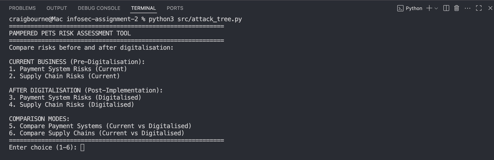
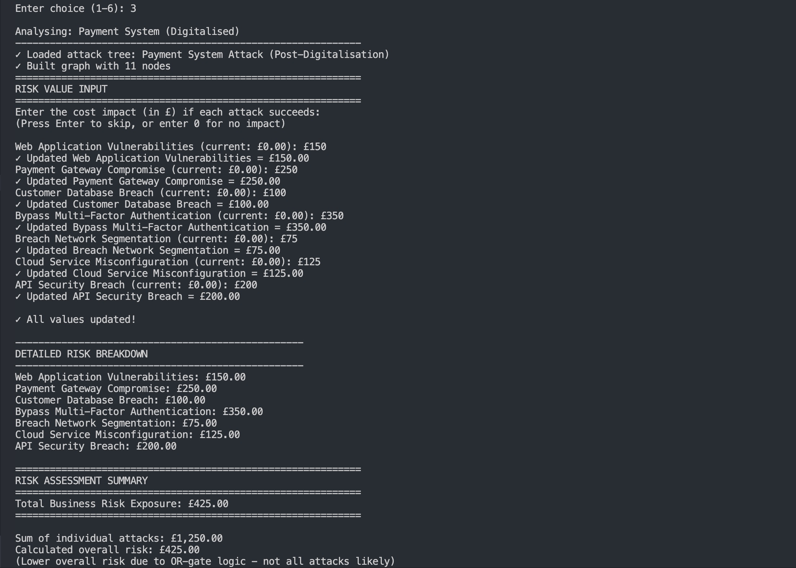
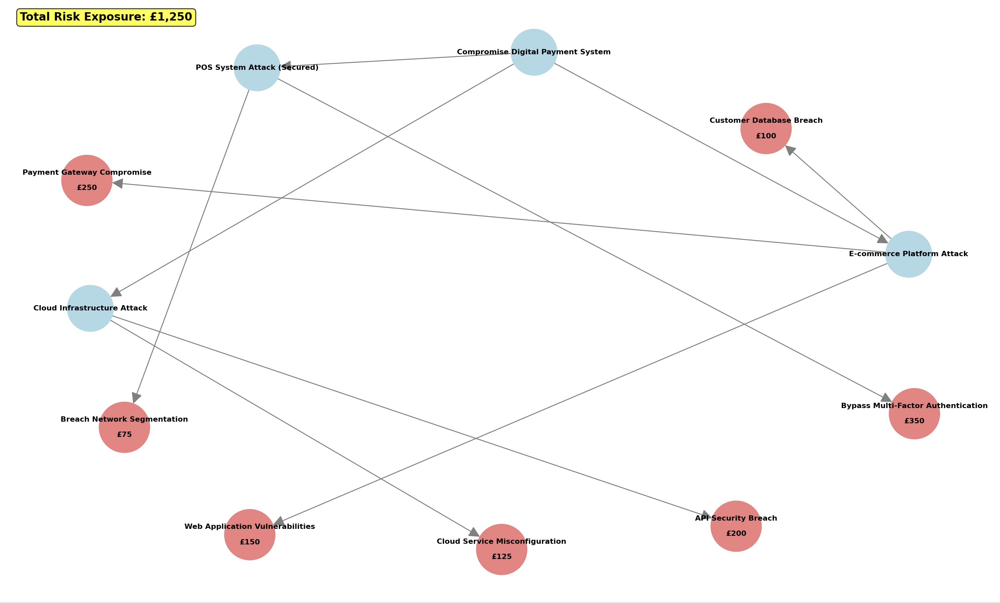
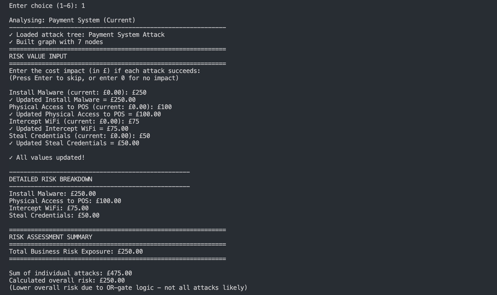
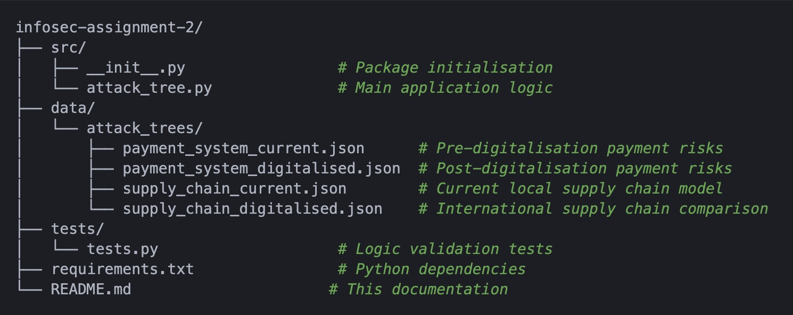
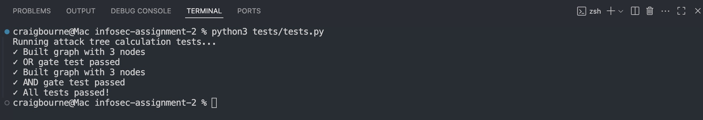
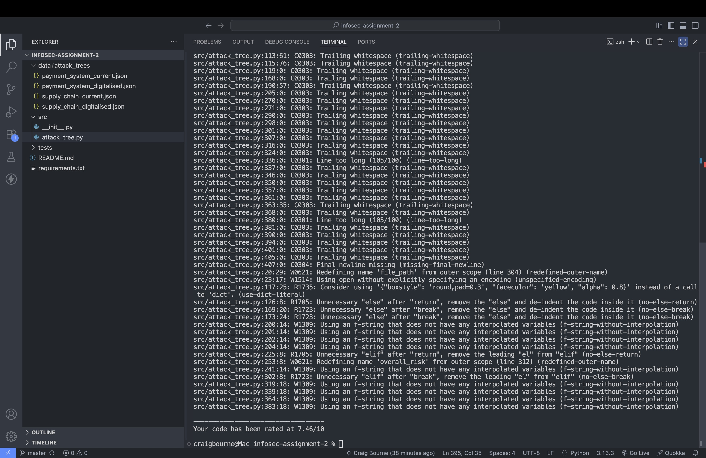
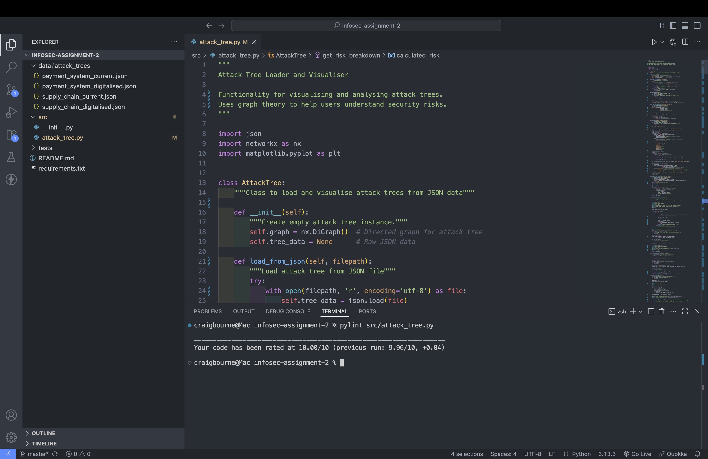

# Attack Tree Visualiser

> Visual risk assessment tool for business decision-making

The Attack Tree Visualiser is a Python application that transforms attack trees into quantified business risk assessments, allowing business stakeholders to visualise security threats through monetary impact. This was developed to address Pampered Pets' digitalisation concerns following an initial risk identification report submitted for Assignment 1.

## Contents
- [Overview](#overview)
- [Features](#features)
- [Installation](#installation)
- [Usage](#usage)
- [File Structure](#file-structure)
- [Assignment 1 Validation and Business Impact](#assignment-1-validation-and-business-impact)
- [Testing and Validation](#testing-and-validation)
- [References](#references)

## Overview
The Attack Tree Visualiser serves as an "unconventional executive summary" for risk assessment, transforming attack scenarios into visual representations with monetary impacts. Following the initial Assignment 1 risk identification report, this application addresses the request from Pampered Pets' shop manager for a more accessible way to understand the implications of Pampered Pets' digitalisation.

**The Problem**: Traditional risk assessments can fail to communicate business impact, relying on technical severity ratings that do not reflect real business risk exposure. As Spring et al. (2021) demonstrate, "CVSS is designed to identify the technical severity of a vulnerability" whilst "what people seem to want to know, instead, is the risk a vulnerability or flaw poses to them" Hubbard (2020) found that popular methods employ "high, medium, low evaluation of likelihood and impact" without proper quantitative foundation.

**The Solution**: The application converts the attack trees and risk scenarios from Assignment 1 into quantified business impacts, enabling data-driven digitalisation decisions through visual analysis.

**Methodological Foundation**: Following the Threat Modelling Manifesto framework (Threat Modeling Manifesto Working Group, 2020) and implementing Tarandach & Coles' (2020) attack tree methodology, the application converts abstract security threats into quantified business risks.

## Features
- **Attack Tree Management**: Load JSON attack trees representing current and post-digitalisation business scenarios
- **Interactive Risk Assessment**: Input monetary values for individual attack methods
- **Transparent Risk Aggregation**: OR/AND gate logic providing business-focused risk calculations
- **Scenario Comparison**: Pre/post digitalisation analysis validating Assignment 1 recommendations
- **Executive Visualisation**: Colour-coded diagrams with risk values and business summaries

## Installation
**System Requirements**
- Python 3.9 or higher
- [pip](https://pypi.org/project/pip/) package management
- Modern web browser
- Minimum 4GB RAM for attack tree processing

**Dependencies and Requirements**
The application requires three core Python libraries as specified in requirements.txt:

```bash
networkx>=3.0 
matplotlib>=3.7.0
numpy>=1.24.0
```

[NetworkX](https://networkx.org/) provides graph algorithms for attack tree representation (NetworkX Developers, 2024), [Matplotlib](https://matplotlib.org/) generates static, animated and interactive diagrams (Matplotlib Development Team et al., 2024) and [NumPy](https://numpy.org/) provides numerical operations for risk calculations (NumPy Developers, 2024).

**Installation Steps**
```bash
# Verify Python version
python --version

# Clone repository
git clone https://github.com/craigbourne/infosec-assignment-2.git
cd infosec-assignment-2

# Create and activate virtual environment
python -m venv venv
source venv/bin/activate  # macOS/Linux

# or on Windows
venv\Scripts\activate

# Install dependencies
pip install -r requirements.txt
```

## Usage
**Launch Application**
```bash
python src/attack_tree.py
```

**Menu Options**

The application provides six analysis scenarios based on the original Assignment 1 risk assessment:



1. **Payment System Risks (Current)** - Pre-digitalisation baseline outlined in Assignment 1
2. **Supply Chain Risks (Current)** - Current local supplier model with 10-minute proximity advantage
3. **Payment System Risks (Digitalised)** - Post-implementation risks following digitalisation recommendations
4. **Supply Chain Risks (Digitalised)** - Demonstrates why local suppliers were recommended over international 24% cost savings
5. **Payment Systems Comparison** - Pre/post-digitalisation supporting the 50% growth opportunity analysis
6. **Supply Chains Comparison** - Local vs international supplier analysis validating Assignment 1 recommendations

**Risk Input Process**
1. Select analysis scenario from the menu
2. Users are then guided through entering costs for each attack method:
   - Prompts appear for each leaf node in the attack tree
   - Current values displayed, can be skipped or updated
   - Input validation ensures positive numbers or zero



3. **Risk breakdown analysis**: System provides detailed breakdown showing:
   - Individual attack costs
   - Sum of all individual attacks
   - Calculated overall risk using OR/AND gate logic
   - Explanation of logic differences

4. **Visual representation**: Attack tree diagram displays with:
   - Colour-coded nodes (red for attacks, blue for logic gates)
   - Monetary values prominently shown on nodes
   - Total risk exposure in summary box
   - Clear hierarchical structure



5. **Business recommendations**: Analysis provides contextual guidance based on risk differentials and Assignment 1 findings

**Example: Payment System Analysis**
When selecting option 1 (Payment System Current), the application guides users through risk value input for threats including:
- Malware installation on POS systems
- Physical access to payment terminals
- WiFi interception of transaction data
- Credential theft from unsecured systems



**Attack Tree Logic Implementation**
The application implements attack tree logic following Tarandach & Coles (2020):
- **OR gates represent alternative attack paths**: Attackers will choose the most feasible route, so the system takes the maximum risk value from child nodes
- **AND gates represent required attack sequences**: All steps must succeed for the attack to work, so risks are cumulative (summed)
- **Leaf nodes**: Individual attack methods with business impact values input by the user
- **Overall risk calculation**: Reflects realistic business exposure rather than theoretical maximum, using transparent logical aggregation

This methodology addresses the "Risk = Threat Capability × Vulnerability × Impact" framework established in FAIR model literature, focusing on impact assessment with transparent logical aggregation.

## File Structure


## Assignment 1 Validation and Business Impact
The application validates the three critical business questions from Assignment 1. It shows that the original selective digitalisation approach is financially justified whilst giving the shop manager the clear, visual risk information they require.

**Methodology**: The application employs attack tree analysis with OR/AND gate logic to convert security threats into monetary impact assessments, enabling comparison of digitalisation scenarios. This approach addresses the limitations of traditional risk assessment methods identified by Hubbard (2020) and Spring et al. (2021), replacing subjective "high, medium, low" ratings with transparent, business-focused risk calculations.

**Q1: Could online presence grow the business by 50%?** 
Digitalisation introduces risks, including malware attacks and payment fraud. However, implementing security controls (WPA3 encryption, role-based access, daily backups) mitigates these risks whilst preserving growth opportunities. Following Fowler's (2023) framework for developing effective risk analysis validates the Assignment 1 recommendation to pursue selective digitalisation with appropriate security investment.

**Q2: Could international supply chain changes reduce costs by 24%?** 
The supply chain comparison provides clear evidence for why the international option is less desirable. Using Kovaitė & Stankevičienė's (2019) RADi framework for digitalisation risks alongside Luo's (2021) framework for international business digitisation, the analysis quantifies how quality control loss,regulatory complexity and expanded attack surfaces create costs that exceed the 24% savings. This validates the Assignment 1 recommendation to maintain local supplier relationships.

**Q3: Could lack of digital features result in 33% customer loss?** 
The scenario comparison analysis (options 5 and 6) indicates that inaction poses the greatest threat to business sustainability. By comparing current operations against digitalised alternatives, the risk of losing customers by remaining offline significantly outweighs the security risks of digital transformation, provided appropriate controls are implemented. This supports the Assignment 1 recommendation for phased digital implementation, building on Sørensen's (2018) recognition that digitalisation creates "massive opportunity" when risks are properly managed.

**Business Impact Summary**: 

This application validates that Assignment 1's risk-based approach to digitalisation was methodologically sound and financially justified. Three key outcomes are demonstrated:

**Risk Quantification**: Converting security threats into monetary impacts enables evidence-based decision-making, addressing Hubbard's (2020) critique of qualitative risk assessment methods.

**Strategic Validation**: The selective digitalisation approach balances growth opportunities against security investments, with local supply chain advantages outweighing international cost saving benefits.

**Practical Implementation**: Security risks can be managed and mitigated through appropriate controls whilst business transformation proceeds, providing the "unconventional executive summary" that bridges technical assessment and business strategy.

The application successfully transforms complex information security analysis into business intelligence, enabling informed strategic decisions for small enterprises navigating digital transformation challenges.

## Testing and Validation
**Running Tests**
```bash
python tests/test_calculations.py
```

The test suite validates core attack tree calculation logic:




**Code Quality Assessment**
The application underwent systematic code quality improvement using pylint analysis:

**Pre-Remediation Results**
- Various style and structural issues identified
- Inconsistent naming conventions
- Code complexity concerns



**Post-Remediation Results**
- Achieved professional standards with **10.00/10.00 pylint score**
- Comprehensive docstring documentation
- Consistent PEP 8 compliance
- Modular, maintainable code structure



**Validation Results**
Testing confirms correct implementation:
- **OR gate logic**: ✓ Correctly implements maximum risk selection reflecting attacker behaviour (choosing easiest path)
- **AND gate logic**: ✓ Accurately sums cumulative risks for sequential attack requirements (all steps must succeed)
- **Graph structure**: ✓ Maintains hierarchical relationships ensuring logical attack tree progression
- **Risk calculations**: ✓ Produces consistent, reproducible results supporting business decision-making
- **JSON loading**: ✓ Handles all four attack tree scenarios without errors
- **User input validation**: ✓ Handles edge cases including invalid inputs and empty values

## References
Fowler, B. (2023) *Information Assurance and Risk Management Strategies*. New York: Apress.

Hubbard, D. (2020) *The Failure of Risk Management: Why It's Broken and How to Fix It*. John Wiley & Sons.

Kovaitė, K. & Stankevičienė, J. (2019) 'Risks of digitalisation of business models', *Contemporary Issues in Business, Management and Economics Engineering*, pp. 380-387.

Luo, Y. (2021) 'A general framework of digitization risks in international business', *Journal of International Business Studies*, 53(2), pp. 344-361.

Matplotlib Development Team, Hunter, J., Dale, D., Firing, E., & Droettboom, M. (2024) *Matplotlib: Visualization with Python*. Available at: https://matplotlib.org/ (Accessed: 17 July 2025).

NetworkX Developers (2024) *NetworkX: Network Analysis in Python*. Available at: https://networkx.org/ (Accessed: 17 July 2025).

NumPy Developers (2024) *NumPy: The fundamental package for scientific computing with Python*. Available at: https://numpy.org/ (Accessed: 17 July 2025).

Sørensen, B.T. (2018) 'Digitalisation: An Opportunity or a Risk?', *Journal of European Competition Law & Practice*, 9(6), pp. 349-350.

Spring, J.M., Hatleback, E., Householder, A.D., Manion, A. & Shick, D. (2021) 'Time to Change the CVSS?', *IEEE Security & Privacy*, 19(2), pp. 74-78.

Tarandach, I. & Coles, M. (2020) *Threat Modeling: A Practical Guide for Development Teams*. O'Reilly Media.

Threat Modeling Manifesto Working Group (2020) *Threat Modeling Manifesto*. Available at: https://www.threatmodelingmanifesto.org

Wang, J., Neil, M. and Fenton, N. (2020) 'A Bayesian network approach for cybersecurity risk assessment implementing and extending the FAIR model', Computers & Security, 89, p. 101659.